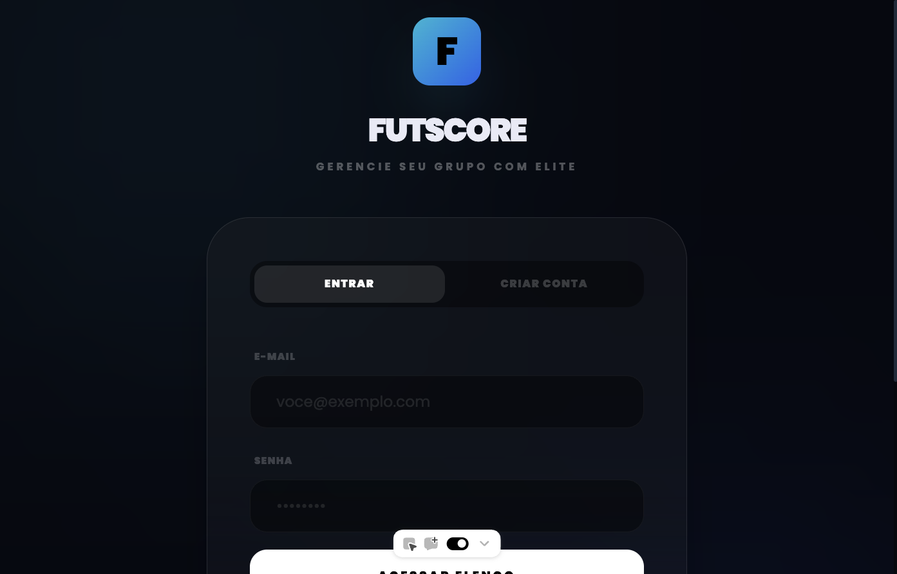

# FutScore — Ultimate Manager

Gerencie seu grupo com elite. App para organizar peladas, montar elenco, avaliar jogadores e sortear times de forma equilibrada.



---

## Funcionalidades

- **Autenticação** — Login, cadastro e **entrar com Google** (Supabase Auth)
- **Múltiplas peladas** — Crie e escolha peladas; cada uma com seu elenco
- **Elenco** — Cadastro de jogadores com posição, atributos (ritmo, finalização, passe, drible, defesa, físico) e overall
- **Dashboard** — Total de jogadores, média geral e top 5
- **Sorteio de times** — Divisão automática com equilíbrio de nível e cobertura de goleiro
- **Visualização tática** — Campo com jogadores posicionados após o sorteio
- **Agenda** — Seção em breve para marcar peladas

---

## Stack

| Tecnologia | Uso |
|------------|-----|
| **React 19** | UI |
| **TypeScript** | Tipagem |
| **Vite 6** | Build e dev server |
| **React Router 7** | Rotas (login → pelada → `/pelada/:nome`) |
| **Supabase** | Login com Google (opcional) |
| **Tailwind (CDN)** | Estilos |

---

## Como rodar

### Pré-requisitos

- Node.js 18+
- pnpm (ou npm/yarn)

### Instalação

```bash
git clone <seu-repo>
cd futscore-—-ultimate-manager
pnpm install
```

### Variáveis de ambiente (opcional)

Para **login com Google**, crie um `.env.local` na raiz:

```env
VITE_SUPABASE_URL=https://seu-projeto.supabase.co
VITE_SUPABASE_ANON_KEY=sua-anon-key
```

No [Supabase](https://supabase.com): **Authentication → Providers → Google** — ative e preencha Client ID e Client Secret. Em **URL Configuration**, adicione sua origem (ex.: `http://localhost:3000/`) em Redirect URLs.

Sem essas variáveis, o app segue funcionando com login/cadastro local e o botão Google usa um fluxo simulado.

### Desenvolvimento

```bash
pnpm dev
```

Abre em **http://localhost:3000/** (ou a porta que o Vite indicar).

### Build

```bash
pnpm build
```

Saída em `dist/`.

### Preview do build

```bash
pnpm preview
```

---

## Estrutura do projeto

```
├── components/
│   ├── AuthScreen.tsx      # Login, cadastro, Google
│   ├── CreatePeladaModal.tsx
│   ├── MainFlow.tsx        # Dashboard, elenco, sorteio, agenda
│   ├── PeladaSelectScreen.tsx
│   ├── PitchSVG.tsx        # Campo e posicionamento
│   ├── PlayerCard.tsx
│   └── RadarChart.tsx      # Atributos do jogador
├── docs/
│   └── screenshots/        # Screenshots para o README
├── App.tsx                 # Rotas e auth
├── supabase.ts             # Cliente Supabase (auth)
├── types.ts
├── utils.ts
├── constants.tsx
└── index.tsx
```

---

## Rotas

| Rota | Descrição |
|------|-----------|
| `/` | Redireciona para `/pelada` |
| `/pelada` | Seleção de pelada (criar ou escolher) |
| `/pelada/:nome` | App principal da pelada (dashboard, elenco, sorteio, agenda) |

O `:nome` na URL é o **slug** do nome da pelada (ex.: `minha-pelada`).

---

## Screenshots

- **Login** — Tela de entrada com opções de login, cadastro e Google (acima).

Para ver a **seleção de pelada** e o **dashboard**, rode o app, faça login e crie ou escolha uma pelada.

---

## Licença

Projeto privado.
